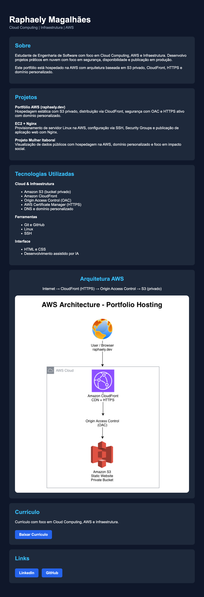
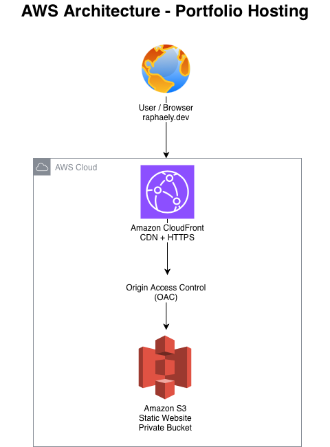

# AWS S3 Static Website Hosting

Projeto de hospedagem de site estático utilizando Amazon S3 com distribuição global via CloudFront.

---

## Live Demo

https://raphaely.dev

---

## Tecnologias utilizadas

- Amazon S3
- Amazon CloudFront
- Static Website Hosting
- Custom Domain (raphaely.dev)
- SSL Certificate (HTTPS)
- HTML

---

## Arquitetura

User → CloudFront → S3 Bucket

### Architecture Diagram

---

## Etapas do projeto

1. Criação do bucket no Amazon S3
2. Upload do arquivo HTML
3. Ativação do Static Website Hosting
4. Configuração de Bucket Policy para acesso público
5. Criação da distribuição CloudFront
6. Configuração de domínio personalizado
7. Ativação de certificado SSL (HTTPS)

---

## Objetivo

Demonstrar na prática a hospedagem de um site estático na AWS utilizando serviços de infraestrutura em nuvem.

---

## Autor

Raphaely Magalhães

LinkedIn: https://linkedin.com/in/raphaely-magalhaes

